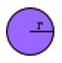

# Algoritmo para cálculo de áreas em C++

> Colaborador: Gabriel Mazzuco ([Github Profile](https://github.com/gabrielmazz))

---

## Objetivo:

O algoritmo foi desenvolvido no intuito de aprofundar um pouco os conhecimento sobre a linguagem C++, usando classes, objetos, construtores e hierarquia

- Cada "Áreas" de algum objeto geométrico possuia uma classe especifica pra o mesmo
- O algoritmo irá calcular as áreas dos objetos, sendo eles
    
    - Triângulo
    - Trapézio
    - Paralelogramo
    - Losango
    - Triângulo Equilátero
    - Hexágono Regular
    - Círculo
    - Setor circular
    - Coroa

---

## Definições de cada objeto:

| Área do Triângulo | $$ A=\frac{b.h}{2} $$ |  |
| --- | --- | --- |

| Área do Trapézio | $$ A=\frac{(B+b).h}{2} $$ |  |
| --- | --- | --- |

| Área do Paralelogramo | $$ A=b.h $$ |  |
| --- | --- | --- |

| Área do Losango | $$ A=\frac{(D.d)}{2} $$ |  |
| --- | --- | --- |

| Área do Triângulo Equilátero | $$ A=\frac{l^2\sqrt{3}}{4} $$ |  |
| --- | --- | --- |

| Área Hexágono Regular | $$ A=\frac{3l^2\sqrt{3}}{2} $$ |  |
| --- | --- | --- |

| Área do Círculo | $$ A=\pi.r^2 $$ |  |
| --- | --- | --- |

| Área do Setor Circular | $$ A=\frac{\alpha.r^2}{2} $$ |  |
| --- | --- | --- |

| Área da Coroa | $$ A=\pi.(R^2-r^2) $$ |  |
| --- | --- | --- |

---

## Funções do C++ usadas:

- Como mensionado acima, o uso de classes foi o maior objetivo dentro do algoritmo
- Usando a herança, existe duas classes que foram adequadas no programa sendo a primeira usada para classificar ```class objeto``` como a área de todos os objetos, e ```class conversao``` para fazermos a conversão de ângulos para radianos

    ```C++
    class Objeto{
        public:
            double area;
    };

    class Conversao{
        public:
            double alfaCoversao(double alfa){
                double alfa_conv = ((alfa * PI)/180);
                return alfa_conv;
            }
    };
    ```

- A classe do objeto era definido primeiro por um teste no ```SetParametros``` para que os valores não fossem menor que 0, apenas para que os valores não ficassem negativos quando o programa executasse e desse um resultado não esperado. Logo abaixo no ```areaObjeto``` é aonde o cálculo realmente acontesse, sendo ali a definição da fórmula da área e mais em baixo no ```printObjeto```, simplismente mostra o valor adquirido.

    ```C++
    class Triangulo_Equilatero : public Objeto{
        private:
            double lado;

        public:
            void SetParametros(double lado){
                if(lado < 0){
                    cout << "Os lados estão com valor negativo" << endl;
                    this->lado = 0;
                }else{
                    this->lado = lado;
                }
            }

            void areaTrianguloEquilatero(){
                this->area = ((pow(lado, 2) * sqrt(3))/4);
            }    

            void printTrianguloEquilatero(){
                cout << "Área do Triangulo Equilatero: " << this->area << endl;
            }
    };
    ```

---

## Funções extras:

- É usado funções extras no programa apenas para embelezar e deixa-lo mais organizado na sua execução, como:

    ```C++
    void clear_screen(void);
    void stop_time(int tempo);
    void stop(void);
    ```

- Podemos ver que o programa funcionara nos dois sistemas operacionais, já que há uma diferenciação na declaração da bibliotecas no linux e no windows

    ```C++
    #ifdef __linux__
        #include <unistd.h>
    #elif _WIN32
        #include <windows.h>
    #endif
    ```

---

# Execução:

- Para executar o programa, existe um makefile para facilitar no processo, basta colocar o comando abaixo no terminal. ```Apenas para Linux```

    ```
    make
    ```

- Para executar normalmente, deve-se usar as seguintes linhas:

    ```
    g++ areas.cpp extras.cpp -o areas
    ./areas
    ```

---